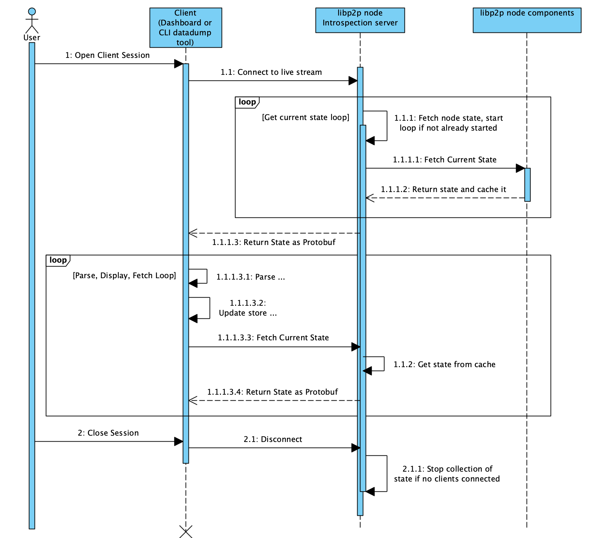

# Pull Based introspection snapshot streaming.

In the [specs/introspection.md > Websocket Protocol section](https://github.com/nearform/go-libp2p-introspection/blob/master/specs/introspection.md#websocket-protocol) spec document it is currently stated:

```
When the client starts up, it will look for the local introspection port of the LibP2P network.  There will also be an option to connect to another host.  Once connected, the introspection module will start extracting the data defined in introspection message from other LibP2P modules such as swarm.

The client listens for the data message from the ws connection and once received and processed for visualization will request for the next data set.  This process will take away the backpressure resposibilty from the server.
```

The specific functionality of this sequence of events is described in the sequence diagram, below.



The specific operation of the libp2p node introspection node collection of data is out of scope of this document.

The UI client interacts via a websocket connection to the introspection server. When the websocket connects the server will send the client the current snapshot from the introspection node as a well formed protobuf message. Whenever any snapshot has been received, parsed, and stored in the UI datastore, the UI will send a message over the websocket connection to signal it is ready for the next snapshot.

The content of this message is currently unspecified, and it could be used in the future for sending some control information about the next sample.

When the server receives the ready signal from the client it will then be able to send the next snapshot. The server should operate to send any snapshot only once even if the client signals it is ready before the next snapshot is generated. The server should not send snapshots if the client has not signaled it is ready to receive one. 

This makes the snapshot sending protocol a relatively request/response protocol, which eliminates backpressure concerns.
