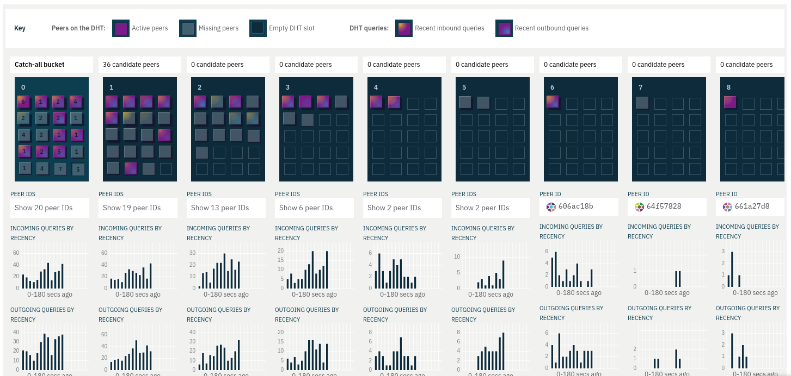

# `dht-buckets` @libp2p/observer-dht-buckets

A libp2p Observer widget, built on built on @libp2p/observer-sdk, visualising peers on the libp2p Distributed Hash Tables and their activity in DHT queries.

## Data compatibility

Note that due to extensive remodelling of the libp2p DHT module in 2020, this widget is not currently compatible with the latest DHT data produced by libp2p introspection, which at time of writing lacks any DHT subsystem due to this ongoing work. The widget also contains features relating to aspects of the DHT that may become out of date, such as missing peers and candidate lists. 

The widget is compatible with current mock sample data from the [samples package](../samples) (sample files and mock data server) and the current [protobuf definition](../proto). The widget will work with data in the following format:

 - **States** snapshots should contain a `DHT` subsytem with `Bucket` and `PeerInDht` message lists filled in as per the current protobuf definition. The peer messages' `status` enum property is used in the following way:
   - `0` ("ACTIVE") - displayed in the DHT bucket and coloured purple
   - `1` ("MISSING") - displayed in the DHT bucket and coloured a less prominent teal
   - `2` ("REJECTED") - removed from display
   - `3` ("CANDIDATE") - moved to a seperate list aside from the bucket
   
 - **Events** should include:
   - An `eventType` named "`InboundDHTQuery`" with JSON content including a property `peerIds` containing an array of peer ID strings involved in the query. The widget uses this to establish which peer(s) in the DHT this query came from.
   - An `eventType` named "`OutboundDHTQuery`" with JSON content also including a property `peerIds` containing an array of peer ID strings involved in the query. The widget uses this to establish which peer(s) in the DHT this query was dispatched to.

These expected event names can be changed with one edit to one file: the values of the `dhtQueryEventNames` object in `<root>/packages/data/lib/enums.js`.

To keep sample data up to date, any such changes should also be mirrored in the mock data scripts in the samples package:

 - `<root>/packages/samples/mock/event-types/InboundDHTQuery.js`
 - `<root>/packages/samples/mock/event-types/OutboundDHTQuery.js`
 - `<root>/packages/samples/mock/messages/dht-queries.js`

## Key features

- Peers are represented as squares on a grid of grids representing the limited available "slots" in a Kademelia-based distrbuted hash table where a fixed number of peers can be stored for each Kademelia distance value.
- Peers can be tracked as they slide on or off the table and from the `0` "catch-all" bucket to specific buckets as the `0` bucket overflows
- Peers' "elevation" visualises relative time in the DHT, allowing older peers to be easily found.
- DHT queries are visualised in real time, as flashes of yellow entering (inbound) or blue exiting (outbound) the peer, with a fading glow representing the scale of recent inbound or outbound activity
- Histograms give a more detailed view of DHT query activity per bucket and, if a peer is selected, per peer.

## Exports

Exports follow the standard format of libp2p Observer widgets:

#### `Widget({ closeWidget })`

 - `closeWidget` (optional): function to close this widget, usually provided automatically by [@libp2p/observer-shell](../shell)

React component rendering this widget. Expects to be rendered inside `ThemeSetter` and `DataProvider` contexts from [@libp2p/observer-sdk](../sdk). These are usually provided by [@libp2p/observer-catalogue](../catalogue) or [@libp2p/observer-testing]](../testing).

#### description

String in plain text or markdown format, describing this widget. 

#### name

String containging this widget's name.

#### screenshot

PNG image displaying a thumbnail image of this widget. Importing packages should have an appropriate webpack loader for handling images.

#### tags

Array of strings listing topics this widget relates to.
